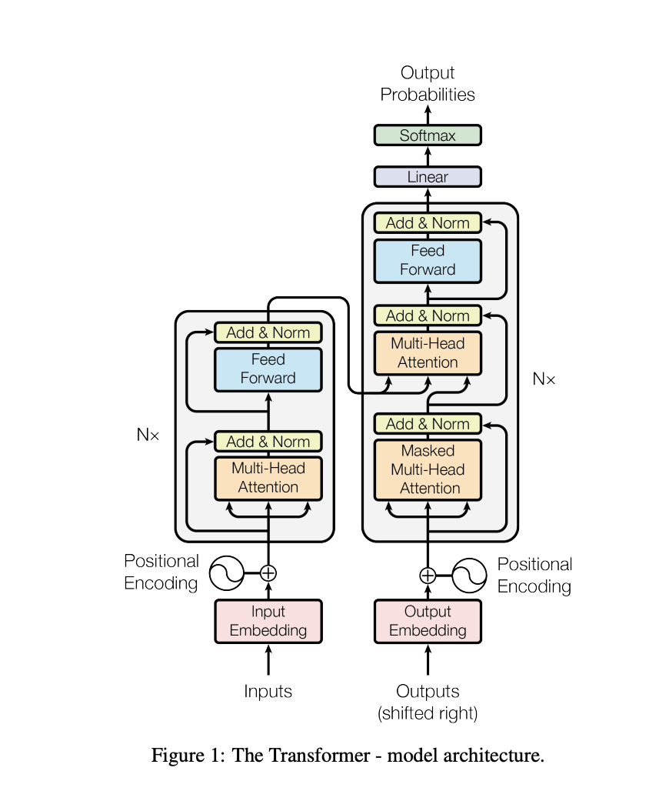

## Character based Tamil language model

### Purpose
Educational

### Goals

- Build a single layer transformer
- Train it using Thirukural dataset
- Run it on a laptop in few minutes

#### Stats
| Key | Value | 
| -- | -- |
| Transformer Layers | 1 |
| Model Params |  66,432 | 
| Vocabulary Size |  64 | 
| Training Tokens | 640294 | 


### Prereq
```
uv pip install torch tqdm matplotlib
```

### Training 
```
uv run train.py
```

### Inference
```
uv run infer.py
```

### Model Summary
```
uv run summary.py
```

#### Expected Results

- After 10 epochs (loss 1.6673)
```
திரும் தெறிக்கும் நீரு என்போது அறிவும் சொல்படங்கிய தாய்ந்குத் தென்னதெனத்து ஒருவன்.
கருணாநிதி: காள் குலகும் வலியாசத்து நற்கி வோது வர்.
வருக்குறள்: பல்லவற்று இன்றையை அனியுமை ஒல்லாத அச்சிய பிடப்போல், இவ்வதற்
```

- After 50 epochs (loss 1.3316)
```
திருந்தாமல் வேண்டார்களுடியின் வாழ்வாறு யாத்துச் சிறந்ததில் பேசாவினால் வுளையே மட்டும்.
திருக்குறள்: ஒருவன் வேண்டு மேனக் கோலைப் ப் பின்றுச்சிகிறப்பும் ஒன்றராப் காகை. தவரேன் இக்கத்தலை.
வரதராய்தரிருகாலேம் தோ,
```

### Learnings

- This is "Hello world" for Transformer models


<table>
  <thead>
    <tr>
      <th>Transformer</th>
      <th>Code</th>
    </tr>
  </thead>
  <tbody>
    <tr>
      <td>| </td>
      <td>
      <pre lang="python">
        <code>
            self.block_size = block_size
            self.token_emb = nn.Embedding(vocab_size, n_embd)
            self.pos_emb = nn.Embedding(block_size, n_embd)
            self.ln1 = nn.LayerNorm(n_embd)
            self.attn = nn.MultiheadAttention(n_embd, n_heads, batch_first=True)
            self.ln2 = nn.LayerNorm(n_embd)
            self.ff = nn.Sequential(
                nn.Linear(n_embd, 4*n_embd),
                nn.ReLU(),
                nn.Linear(4*n_embd, n_embd)
            )
            self.lm_head = nn.Linear(n_embd, vocab_size)
            </code></pre></td>
    </tr>
</tbody>
</table>

- Training loop is exactly similar to any other Neural network

```
model = 
optimizer = 

loop:
    x,y = getData()
    loss = model(x,y)
    loss.backward()
    optimizer.step()
```
- Preparing the training data and shaping them, input to the transformer is `batch` x `block_size`

- This completes a simple lifecycle, data prep, training and inference, all running locally 

- Next step is to scale this up, to see what more model params with more data with more time can do

https://github.com/mukundha/tamil-token-lm

 ##### CITATION
 - Thirukural dataset downloaded from https://github.com/tk120404/thirukkural
 - Attention is all you need - https://arxiv.org/abs/1706.03762
  

 #### [License](./LICENSE)